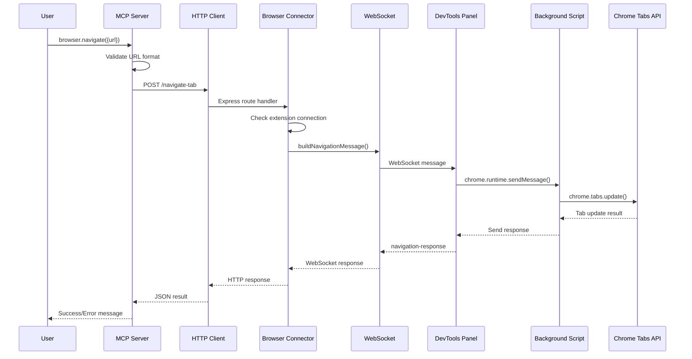

# Browser.Navigate Tool End-to-End Analysis

## 1) Tool Summary

**Purpose**: Navigates the current active browser tab to a new URL, providing programmatic control over browser navigation for automated testing, navigation flows, and page redirection.

**Entry points**: `browser.navigate` tool identifier

**Layers touched**:

- ✅ MCP tool (registration and validation)
- ✅ Server helpers (navigation message building/parsing)
- ✅ Browser connector (HTTP endpoint and WebSocket forwarding)
- ✅ Chrome extension (background script navigation execution)

## 2) File Inventory

**Execution Flow Order:**

1. **MCP Tool Definition**:

   - `browser-tools-mcp/mcp-server.ts` - Tool registration and validation logic
   - `browser-tools-mcp/dist/mcp-server.js` - Compiled tool implementation

2. **Server Helpers**:

   - `browser-tools-server/modules/navigation.ts` - Navigation message builders and parsers
   - `browser-tools-server/dist/modules/navigation.js` - Compiled navigation helpers

3. **Browser Connector**:

   - `browser-tools-server/browser-connector.ts` - Express endpoint and WebSocket forwarding
   - `browser-tools-server/dist/browser-connector.js` - Compiled connector implementation

4. **Chrome Extension**:

   - `chrome-extension/background.js` - Background script navigation execution
   - `chrome-extension/devtools.js` - DevTools panel message forwarding

5. **Documentation**:
   - `docs/each-tool-explained/browser_navigate.md` - Tool documentation and examples

## 3) Parameters and Contracts

### Tool Parameters

| Parameter | Type     | Required | Default | Validation                                                    |
| --------- | -------- | -------- | ------- | ------------------------------------------------------------- |
| `url`     | `string` | ✅       | N/A     | Must be valid URL with protocol (e.g., `https://example.com`) |

### Request/Response Interfaces

**MCP Request Schema**:

```typescript
{
  url: z.string().describe(
    "The URL to navigate to (must be a valid URL including protocol, e.g., 'https://example.com')"
  );
}
```

**MCP Success Response**:

```json
{
  "content": [
    {
      "type": "text",
      "text": "✅ Successfully navigated browser tab to: https://example.com"
    }
  ]
}
```

**MCP Error Response**:

```json
{
  "content": [
    {
      "type": "text",
      "text": "Failed to navigate browser tab: Chrome extension not connected"
    }
  ],
  "isError": true
}
```

### Error Models

- **URL Format Error**: Invalid URL format (missing protocol)
- **Extension Connection Error**: Chrome extension not connected
- **Navigation Timeout**: 10-second timeout exceeded
- **Extension Communication Error**: Failed to communicate with background script

## 4) Execution Flow (Step-by-Step)

1. **MCP Tool Invocation**:

   - User calls `browser.navigate({ url: "https://example.com" })`
   - MCP server validates URL format using `new URL(url)`

2. **Server Connection**:

   - Tool uses `withServerConnection()` wrapper to ensure browser server is available
   - Discovers server host/port via `discoveredHost`/`discoveredPort`

3. **HTTP Forwarding**:

   - Makes HTTP POST to `http://${host}:${port}/navigate-tab`
   - Sends JSON payload: `{ url: "https://example.com" }`

4. **Browser Connector Processing**:

   - Express route `/navigate-tab` receives request
   - Validates extension connection (`this.activeConnection`)
   - Generates unique `requestId` (timestamp)

5. **WebSocket Message Building**:

   - Uses `buildNavigationMessage()` helper to create WebSocket payload
   - Payload: `{ type: "navigate-tab", url: "...", requestId: "..." }`

6. **Extension Message Handling**:

   - DevTools panel receives WebSocket message
   - Forwards to background script via `chrome.runtime.sendMessage()`
   - Background script executes `chrome.tabs.update(tabId, { url })`

7. **Response Flow**:
   - Background script sends response to DevTools panel
   - DevTools panel forwards via WebSocket as `navigation-response`
   - Browser connector resolves promise based on success/failure
   - HTTP response returned to MCP tool
   - MCP tool formats final response to user

### Call Graph

```
browser.navigate() → MCP Tool Handler → withServerConnection() → HTTP POST /navigate-tab → Express Route Handler → WebSocket.send() → DevTools Panel → chrome.runtime.sendMessage() → Background Script → chrome.tabs.update() → Response Flow (reverse)
```

## 5) Data Flow Diagram



## 6) Security and Privacy

**Input Sanitization**:

- URL validation using `new URL()` constructor to ensure valid format
- No direct user input sanitization beyond URL format validation

**URL Handling**:

- Requires complete URLs with protocol (prevents relative path injection)
- No URL allowlist/denylist filtering implemented

**Credential Handling**:

- No credentials embedded in navigation requests
- URL parameters may contain sensitive data (not filtered)

**Permissions**:

- Chrome extension requires `"tabs"` permission for tab manipulation
- Requires `"activeTab"` permission for accessing current tab
- Requires `"<all_urls>"` permission for navigating to any URL

## 7) Performance and Reliability

**Timeouts**:

- 10-second timeout for navigation completion
- HTTP client uses default fetch timeout
- No configurable timeout parameters

**Retries**:

- No automatic retry logic in navigation flow
- Background script has retry logic for server communication (5 attempts with exponential backoff)

**Concurrency**:

- Single navigation request at a time per browser connector instance
- Uses temporary message handlers to avoid race conditions
- Promise-based async handling prevents blocking

**Resource Management**:

- Message handlers are properly cleaned up after use
- Tab URL caching in background script for performance
- WebSocket connection maintained throughout session

## 8) Testing and Observability

**Logging**:

- MCP level: Console logs for navigation attempts and results
- Browser connector: Info/debug logs for request processing
- Extension: Console logs for message forwarding and tab updates

**Error Handling**:

- Comprehensive error catching at each layer
- Specific error messages for different failure modes
- Graceful degradation when extension is unavailable

**Monitoring**:

- No metrics collection implemented
- Connection status tracking via background script
- URL change notifications sent to server on tab updates

## 9) Touched Files and Code Snippets

```118:131:browser-tools-mcp/mcp-server.ts
// Generate dynamic description for navigate tool
function generateNavigateToolDescription(): string {
  const baseDescription =
    "Navigates the current active browser tab to a new URL. **Use for automated testing, navigation flows, or redirecting to specific pages.** Requires Chrome extension to be connected.";

  // Get routes file path dynamically each time
  const routesFilePath = getConfigValue("ROUTES_FILE_PATH");

  if (routesFilePath) {
    return `${baseDescription}\n\n**Route Reference**: If unsure about available paths, check the routes file at \`${routesFilePath}\` for the correct routes to use.`;
  } else {
    return `${baseDescription}\n\n**Route Reference**: ROUTES_FILE_PATH variable is not set so make sure you know the routes to use`;
  }
}
```

```1621:1631:browser-tools-mcp/mcp-server.ts
// Register navigate tool with static description (set once at startup)
server.tool(
  "browser.navigate",
  generateNavigateToolDescription(),
  {
    url: z
      .string()
      .describe(
        `The URL to navigate to (must be a valid URL including protocol, e.g., 'https://example.com')`
      ),
  },
```

```1632:1705:browser-tools-mcp/mcp-server.ts
async (params) => {
  return await withServerConnection(async () => {
    try {
      const { url } = params;

      // Validate URL format
      try {
        new URL(url);
      } catch (e) {
        return {
          content: [
            {
              type: "text",
              text: `Invalid URL format: ${url}. Please provide a complete URL including protocol (e.g., 'https://example.com')`,
            },
          ],
          isError: true,
        };
      }

      const targetUrl = `http://${discoveredHost}:${discoveredPort}/navigate-tab`;
      const requestPayload = {
        url: url,
      };

      console.log(`MCP Tool: Navigating browser tab to ${url}`);

      const response = await fetch(targetUrl, {
        method: "POST",
        headers: {
          "Content-Type": "application/json",
        },
        body: JSON.stringify(requestPayload),
      });

      const result = await response.json();

      if (response.ok && result.success) {
        return {
          content: [
            {
              type: "text",
              text: `✅ Successfully navigated browser tab to: ${url}`,
            },
          ],
        };
      } else {
        return {
          content: [
            {
              type: "text",
              text: `Failed to navigate browser tab: ${
                result.error || "Unknown error"
              }`,
            },
          ],
          isError: true,
        };
      }
    } catch (error: any) {
      const errorMessage =
        error instanceof Error ? error.message : String(error);
      return {
        content: [
          {
            type: "text",
            text: `Failed to navigate browser tab: ${errorMessage}`,
          },
        ],
        isError: true,
      };
    }
  });
}
```

```20:29:browser-tools-server/modules/navigation.ts
/**
 * Build the navigation message payload to send over WebSocket to the extension.
 */
export function buildNavigationMessage(
  req: { url: string },
  requestId: string
) {
  return JSON.stringify({
    type: "navigate-tab",
    url: req.url,
    requestId,
  });
}
```

```34:49:browser-tools-server/modules/navigation.ts
/**
 * Narrow and validate the navigation response coming back over WebSocket.
 */
export function parseNavigationResponse(
  data: any,
  expectedRequestId: string
): NavigationResult | undefined {
  if (
    data &&
    data.type === "navigation-response" &&
    data.requestId === expectedRequestId
  ) {
    if (data.success) {
      return { success: true };
    }
    return { success: false, error: data.error };
  }
  return undefined;
}
```

```1324:1344:browser-tools-server/browser-connector.ts
// Add navigation endpoint
async navigateTab(
  req: express.Request,
  res: express.Response
): Promise<void> {
  if ((process.env.LOG_LEVEL || "info").toLowerCase() === "debug") {
    console.log("[debug] navigateTab handler", req.body);
  }
  logInfo("Browser Connector: Received navigateTab request");
  logDebug("Browser Connector: Request body:", req.body);

  const { url } = req.body;

  if (!url) {
    res.status(400).json({ error: "Missing URL parameter" });
    return;
  }

  if (!this.activeConnection) {
    res.status(503).json({ error: "Chrome extension not connected" });
    return;
  }
```

```1346:1417:browser-tools-server/browser-connector.ts
try {
  logDebug("Browser Connector: Sending navigation request to extension");

  // Create a promise that will resolve when we get the navigation response
  const navigationPromise = new Promise<{
    success: boolean;
    error?: string;
  }>((resolve, reject) => {
    const requestId = Date.now().toString();

    // Set up a one-time message handler for this navigation request
    const messageHandler = (
      message: string | Buffer | ArrayBuffer | Buffer[] | Buffer
    ) => {
      try {
        const data = JSON.parse(message.toString());

        // Parse navigation response using tool helper (statically imported)
        const parsed = parseNavigationResponse(data, requestId);
        if (parsed) {
          // Remove this listener once we get a response
          this.activeConnection?.removeListener("message", messageHandler);

          if (parsed.success) {
            resolve({ success: true });
          } else {
            resolve({ success: false, error: parsed.error });
          }
        }
      } catch (error) {
        // Ignore parsing errors for other messages
      }
    };

    // Add temporary message handler
    this.activeConnection?.on("message", messageHandler);

    // Send navigation request to extension (using tool builder - statically imported)
    this.activeConnection?.send(buildNavigationMessage({ url }, requestId));

    // Set timeout
    setTimeout(() => {
      this.activeConnection?.removeListener("message", messageHandler);
      reject(new Error("Navigation timeout"));
    }, 10000); // 10 second timeout
  });

  const result = await navigationPromise;

  if (result.success) {
    logInfo("Browser Connector: Navigation completed successfully");
    res.json({ success: true, url: url });
  } else {
    console.error(
      "[error] Browser Connector: Navigation failed:",
      result.error
    );
    res.status(500).json({ error: result.error || "Navigation failed" });
  }
} catch (error) {
  console.error(
    "[error] Browser Connector: Error during navigation:",
    error
  );
  res.status(500).json({
    error:
      error instanceof Error
        ? error.message
        : "An unknown error occurred during navigation",
  });
}
```

```1492:1557:chrome-extension/devtools.js
} else if (message.type === "navigate-tab") {
  console.log(
    "Chrome Extension: Received navigation request:",
    message
  );

  // Forward the request to the background script
  chrome.runtime.sendMessage(
    {
      type: "NAVIGATE_TAB",
      url: message.url,
      tabId: message.tabId || chrome.devtools.inspectedWindow.tabId,
    },
    (response) => {
      if (chrome.runtime.lastError) {
        console.error(
          "Chrome Extension: Error navigating tab:",
          chrome.runtime.lastError
        );

        // Send error response back to server
        ws.send(
          JSON.stringify({
            type: "navigation-response",
            requestId: message.requestId,
            success: false,
            error:
              "Failed to communicate with background script: " +
              chrome.runtime.lastError.message,
          })
        );
        return;
      }

      if (response && response.success) {
        console.log(
          "Chrome Extension: Navigation successful to:",
          message.url
        );
        // Send success response back to server
        ws.send(
          JSON.stringify({
            type: "navigation-response",
            requestId: message.requestId,
            success: true,
            url: message.url,
          })
        );
      } else {
        console.log(
          "Chrome Extension: Navigation failed:",
          response?.error
        );
        // Send error response back to server
        ws.send(
          JSON.stringify({
            type: "navigation-response",
            requestId: message.requestId,
            success: false,
            error: response?.error || "Unknown error during navigation",
          })
        );
      }
    }
  );
```

```50:81:chrome-extension/background.js
if (message.type === "NAVIGATE_TAB" && message.url) {
  console.log("Background: Received navigation request:", message);

  const targetTabId =
    message.tabId || chrome.devtools?.inspectedWindow?.tabId;

  if (!targetTabId) {
    console.error("Background: No target tab ID available for navigation");
    sendResponse({ success: false, error: "No target tab ID available" });
    return true;
  }

  // Navigate the tab to the specified URL
  chrome.tabs.update(targetTabId, { url: message.url }, (tab) => {
    if (chrome.runtime.lastError) {
      console.error(
        "Background: Navigation failed:",
        chrome.runtime.lastError
      );
      sendResponse({
        success: false,
        error: chrome.runtime.lastError.message,
      });
    } else {
      console.log("Background: Navigation successful to:", message.url);
      // Update our cache with the new URL
      tabUrls.set(targetTabId, message.url);
      sendResponse({ success: true, url: message.url });
    }
  });
  return true; // Required to use sendResponse asynchronously
}
```

## 10) Risks, Gaps, and TODOs

### Known Risks

1. **No URL Validation Beyond Format**: Only validates URL syntax, no content filtering
2. **Race Conditions**: Potential issues if multiple navigation requests occur simultaneously
3. **Extension Dependency**: Complete failure if Chrome extension is not connected
4. **Timeout Issues**: Fixed 10-second timeout may not be appropriate for all sites

### Gaps Identified

1. **Missing Input Sanitization**: No protection against malicious URLs
2. **No Rate Limiting**: No protection against navigation spam
3. **Limited Error Context**: Error messages could be more descriptive
4. **No Navigation History**: No tracking of navigation history or rollback capability

### Recommended Improvements

1. **Add URL Allowlist**: Implement configurable URL domain restrictions
2. **Improve Error Handling**: Add more specific error types and recovery strategies
3. **Add Navigation Validation**: Verify navigation actually occurred and page loaded
4. **Implement Retry Logic**: Add configurable retry attempts for failed navigations
5. **Add Navigation Analytics**: Track navigation success/failure rates

## 11) Appendix: Raw Symbol Index

### Key Functions by Layer

**MCP Tool Layer**:

- `generateNavigateToolDescription()` - Dynamic description generation
- `browser.navigate` tool handler - Main navigation logic
- `withServerConnection()` - Server connection wrapper

**Server Helper Layer**:

- `buildNavigationMessage()` - WebSocket message construction
- `parseNavigationResponse()` - Response validation and parsing

**Browser Connector Layer**:

- `navigateTab()` - Express endpoint handler
- WebSocket message handling - Async response processing

**Chrome Extension Layer**:

- `NAVIGATE_TAB` message handler - Background script navigation
- DevTools panel message forwarding - WebSocket to runtime bridge

### File Path Index

- `/browser-tools-mcp/mcp-server.ts` - MCP tool registration and validation
- `/browser-tools-server/modules/navigation.ts` - Navigation helpers
- `/browser-tools-server/browser-connector.ts` - HTTP/WebSocket bridging
- `/chrome-extension/background.js` - Chrome tabs API integration
- `/chrome-extension/devtools.js` - Extension message routing
