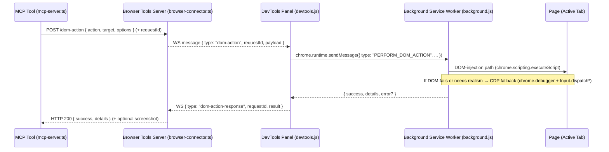

## Plan: Page Interaction MCP Tool (DOM-first with CDP fallback)

### 1) Goal and scope
- Enable autonomous agents to interact with the active web app by reliably targeting elements (form fields, buttons) and performing actions (click, type, select, check/uncheck, keypress, hover, scroll) using semantic selectors.
- Fit into the existing MCP → server → Chrome extension pipeline you already use for navigation, screenshots, console/network inspection.
- Prioritize accessibility/semantic targeting; fall back to CDP input dispatch; optional last-resort vision/coordinates later.

Out of scope (initially): cross-origin iframes interactions, file uploads, complex drag-and-drop. These can be added after v1.

### 2) High-level architecture



Key principle: keep the active-tab flow you already have (like navigate and screenshot), add a new message/action pair for interactions.

### 3) New MCP tool: `interactWithPage`

- Location: `browser-tools-mcp/mcp-server.ts`
- Description: Perform page interactions in the active browser tab using semantic selectors with intelligent waits and a CDP fallback.

Parameters (v1):
- action: "click" | "type" | "select" | "check" | "uncheck" | "keypress" | "hover" | "waitForSelector"
- target: { by: "testid" | "role" | "label" | "text" | "placeholder" | "name" | "css" | "xpath", value: string, exact?: boolean }
- value?: string (for type/select/keypress)
- options?: {
  timeoutMs?: number; // default 5000
  waitForVisible?: boolean; // default true
  waitForEnabled?: boolean; // default true
  waitForNetworkIdleMs?: number; // default 0 (off); use existing network tool to validate if needed
  postActionScreenshot?: boolean; // default false
  screenshotLabel?: string;
  fallbackToCdp?: boolean; // default true
  frameSelector?: string; // future: target specific same-origin iframe
}

Response:
- success: boolean
- message?: string
- details?: {
  selectorUsed: string;
  matchedCount?: number;
  boundingBox?: { x: number; y: number; width: number; height: number };
  navigationOccurred?: boolean;
}
- image?: PNG (if screenshot requested)

Transport:
- MCP tool → POST `http://{host}:{port}/dom-action`
- Server to extension via WS: `{ type: "dom-action", requestId, payload }`
- Response WS: `{ type: "dom-action-response", requestId, success, details?, error? }`

### 4) Server changes (`browser-tools-server`)

Files to edit/add:
- `browser-tools-server/browser-connector.ts`
  - Add Express endpoint `POST /dom-action`
  - Validate body; ensure `activeConnection` exists
  - Generate `requestId`
  - Send WS message to devtools client: `type: "dom-action"`
  - Await one-time response `type: "dom-action-response"` with matching `requestId`
  - Timeout and error mapping similar to `/navigate-tab`
  - Log via `modules/logger.ts`

- Optional: `browser-tools-server/modules/input-actions.ts` (new)
  - Type definitions for request/response payloads
  - Helper to build/parse messages (mirroring `modules/navigation.ts` style)

Observability:
- Include action, selector, timing, success/failure in logs.
- Reuse `/connection-health` to reflect pending actions count if useful.

### 5) Extension changes (`chrome-extension`)

- `devtools.js`
  - WS handler: on `{ type: "dom-action" }` forward to background:
    - `chrome.runtime.sendMessage({ type: "PERFORM_DOM_ACTION", requestId, payload })`
    - On callback, send WS `{ type: "dom-action-response", requestId, ...result }`

- `background.js`
  - Add message listener for `PERFORM_DOM_ACTION`.
  - DOM-injection path (default):
    - Use `chrome.scripting.executeScript({ target: { tabId }, world: 'MAIN', func: performDomAction, args: [payload] })`
    - `performDomAction` in-page function:
      - Resolve element using selector priority: data-testid → role+name → label text → placeholder/name → text → CSS → XPath
      - Wait loop: existence, visibility, enabled state; `scrollIntoView`
      - Actions:
        - click: dispatch pointerdown/mousedown/mouseup/click
        - type: focus → set value or insert text → dispatch input/change
        - select: set value/selectedIndex → dispatch input/change
        - check/uncheck: toggle `checked` and dispatch change
        - keypress: dispatch KeyboardEvent or use CDP fallback for fidelity
      - Return { success, selectorUsed, matchedCount, boundingBox }

  - CDP fallback (when `fallbackToCdp` or DOM path fails):
    - `chrome.debugger.attach({tabId}, "1.3")`
    - `Runtime.evaluate` to compute element bounding box/center or to resolve via selectors across Shadow DOM
    - `Input.dispatchMouseEvent` (movedown/up/click), `Input.insertText` or `Input.dispatchKeyEvent`
    - `chrome.debugger.detach`

  - Post-action screenshot (optional):
    - If requested, call existing `CAPTURE_SCREENSHOT` flow and include path/title in result

Notes:
- DevTools-only APIs (network capture) live in `devtools.js`; background cannot access them directly. For network verification, use the existing MCP tools (`inspectBrowserNetworkActivity`) after action completes.

### 6) Selector strategy details

Priority and heuristics:
1. `data-testid="VALUE"`
2. `getByRole(ROLE, { name: VALUE })` equivalent: in-page accessible name computation via ARIA (simple heuristic v1)
3. `<label>` text to control association (`for` attribute or wrapping)
4. `placeholder` or `name` equals VALUE
5. Exact visible text match (button/link/heading, etc.)
6. CSS selector
7. XPath (last resort)

Visibility/enabled checks:
- Element exists, `offsetParent` or `getBoundingClientRect().height/width > 0`, not `disabled`, not `aria-disabled="true"`
- Ensure in viewport via `scrollIntoView({ block: 'center', inline: 'center' })`

Event fidelity:
- Click: pointerdown → mousedown → mouseup → click (bubbles: true)
- Type: `focus()` → set selection → insert value → dispatch `input` and `change`

Shadow DOM and iframes:
- v1: Handle Shadow DOM if open and same-origin by walking `shadowRoot` at each step when selector uses `>>` notation (future enhancement)
- v1: Same-origin iframes via `frameSelector` (future enhancement)
- If blocked, fall back to CDP coordinate click

### 7) Error handling and timeouts

- Standard timeout: `timeoutMs` (default 5000)
- Categorical errors: `ELEMENT_NOT_FOUND`, `NOT_VISIBLE`, `DISPATCH_FAILED`, `CDP_ATTACH_FAILED`, `TIMEOUT`
- Map errors to user-friendly messages and include the attempted selector chain
- Always include partial diagnostics: which selectors were tried, final target resolved or not, bbox if any

### 8) Observability

- Log on server with action, target, outcome, duration
- Optionally include small thumbnails of screenshots in logs when requested
- Return `details.navigationOccurred` if the click triggers a navigation (inferred from URL change info you already propagate)

### 9) Configuration

Environment variables (optional v1):
- `LOG_LEVEL` already in place
- Add default action timeouts and behavior as constants in server (`DEFAULT_ACTION_TIMEOUT_MS`, `ACTION_FALLBACK_TO_CDP`)

Per-project behavior:
- No project-specific storage required; piggyback on existing project resolution for screenshots and logs

### 10) Security and safety

- Restrict actions to the currently inspected tab (no arbitrary tabs)
- Validate strings (length caps) and reject script injection in selectors/values
- Consider a safe-mode that only allows actions on `http(s)://localhost` by default

### 11) Testing strategy

- Demo page: simple form with fields and submit button; include `data-testid` hooks
- Unit-like tests: scripted sequences via MCP calling `interactWithPage` then `inspectBrowserNetworkActivity`
- Manual tests: try label/name/role/text-only UIs; try Shadow DOM sample; verify CDP fallback

### 12) Phased rollout

Phase 1 (MVP):
- Server: `/dom-action` endpoint + WS relay and response plumbing
- Extension: `dom-action` handling, DOM-injection actions (click, type, select, check/uncheck) with `data-testid`, label, text, css
- Optional screenshot post-action

Phase 2:
- Add CDP fallback for clicks/typing and simple Shadow DOM cases
- Add `keypress`, `hover`, `waitForSelector`

Phase 3:
- Role+name via better accessibility name computation
- Iframe targeting (`frameSelector`)
- File uploads, drag-and-drop
- Optional vision/coordinate fallback

### 13) Minimal implementation checklist

- [ ] MCP: Register `interactWithPage` tool in `mcp-server.ts`
- [ ] Server: Implement `POST /dom-action` + WS request/response roundtrip (with timeout)
- [ ] Extension (devtools.js): Route WS `dom-action` to background and v.v.
- [ ] Extension (background.js): Implement `PERFORM_DOM_ACTION` with DOM injection path
- [ ] Add logs and basic error mapping; reuse screenshot tool
- [ ] Docs: Add usage examples to `docs/each-tool-explained/`

### 14) Example payloads

MCP → Server (`/dom-action`):
```json
{
  "action": "type",
  "target": { "by": "placeholder", "value": "Email" },
  "value": "user@example.com",
  "options": { "timeoutMs": 7000, "postActionScreenshot": true }
}
```

Server → Extension (WS):
```json
{
  "type": "dom-action",
  "requestId": "1705311045123",
  "payload": { "action": "click", "target": { "by": "testid", "value": "submit-button" } }
}
```

Extension → Server (WS response):
```json
{
  "type": "dom-action-response",
  "requestId": "1705311045123",
  "success": true,
  "details": { "selectorUsed": "[data-testid=submit-button]", "matchedCount": 1 }
}
```

### 15) Notes on Playwright MCP vs in-tab approach

- Playwright MCP provides production-grade interactions in a separate browser; great for E2E suites
- This plan keeps interactions within the already-open DevTools tab, integrating seamlessly with your existing tools (network, console, screenshots)
- You can later add an alternative tool that proxies to a Playwright MCP server for heavy-duty flows; both can coexist


