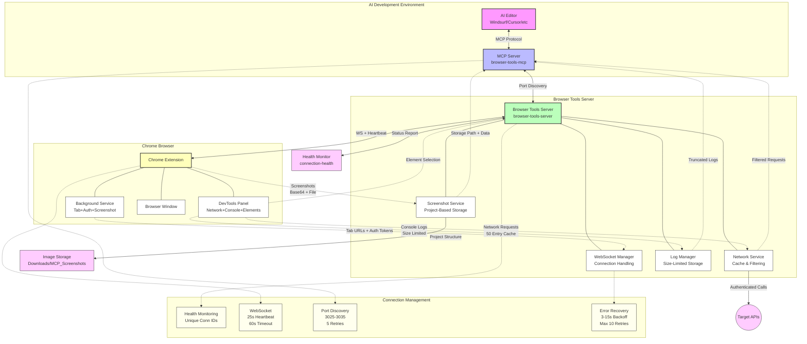

# Browser Tools MCP Extension - Complete Project Overview

**🚀 Version 1.2.0 - Autonomous AI-Powered Frontend Development Platform**

- Contents:
  - Executive Summary
  - System Architecture
  - Server Features
  - Health Monitoring API

## 📋 Executive Summary

The Browser Tools MCP Extension is a comprehensive solution designed for **autonomous AI-powered frontend development workflows**. This system provides AI agents with reliable access to browser state, real-time debugging information, and seamless screenshot capabilities through enhanced WebSocket connections optimized for extended development sessions.

### 🎯 Project Mission

Enable AI development tools to work autonomously for hours without manual intervention by providing:

- **Stable browser integration** with intelligent connection recovery
- **Real-time context capture** (logs, network requests, screenshots)
- **Organized data storage** for persistent AI workflow continuity
- **Enhanced error handling** for autonomous operation reliability

---

## 🏗️ System Architecture

### Three-Component Architecture



#### 1. **MCP Server** (`browser-tools-mcp/`)

- **Role**: Model Context Protocol implementation
- **Function**: Provides standardized AI tool interface
- **Key Features**: Enhanced server discovery, retry logic, connection health monitoring
- **AI Integration**: Compatible with Windsurf, Cursor, Cline, Zed, Claude Desktop

#### 2. **Browser Tools Server** (`browser-tools-server/`)

- **Role**: Central coordination hub
- **Function**: WebSocket management, data processing, screenshot coordination
- **Key Features**: Enhanced heartbeat system, individual request tracking, auto-port detection
- **Network**: HTTP REST API + WebSocket real-time communication

#### 3. **Chrome Extension** (`chrome-extension/`)

- **Role**: Browser integration layer
- **Function**: Real-time data capture, screenshot execution, DevTools integration
- **Key Features**: Fast reconnection, exponential backoff, streamlined discovery
- **UI**: DevTools panel with connection monitoring and manual controls

---

## 🔧 Server Features

- Auto-port detection (starts at 3025, selects 3026–3035 as needed)
- Connection health endpoint at `/connection-health`
- Heartbeat 25s, timeout 60s; fast reconnection (3–15s)
- Identity endpoint at `/.identity`
- Individual request tracking and improved callback cleanup

### 📊 Health Monitoring API

Real-time connection status at `/connection-health`:

```json
{
  "connected": true,
  "healthy": true,
  "connectionId": "conn_1735814017588_abc123",
  "heartbeatTimeout": 60000,
  "heartbeatInterval": 25000,
  "pendingScreenshots": 0,
  "uptime": 3600.45
}
```
